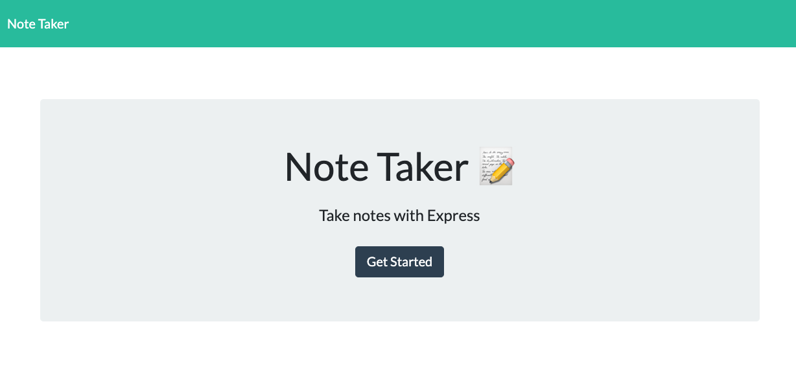
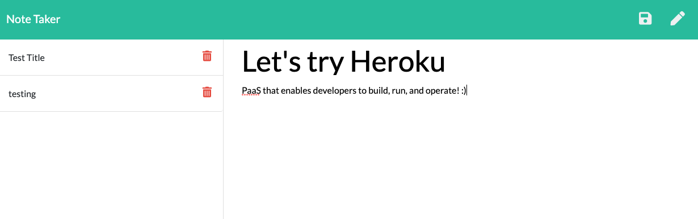

# Note_Taker
This program is created using Express.js and Node.js.  This allows the user to created, view and delete a note.  

[Note Taker in Heroku]()

## Installation
To be able to make this program work, NPM Express module needs to be installed and declared as required in Server.js file.

After running node server.js in the users terminal, the link to the localhost will show in the console and it will redirect to the home page of the application. From the home page, once the user click on the "Get Started", it will be redirected to the notes page where the user can start putting notes, viewing old notes or deleting it.

## Usage
;
 